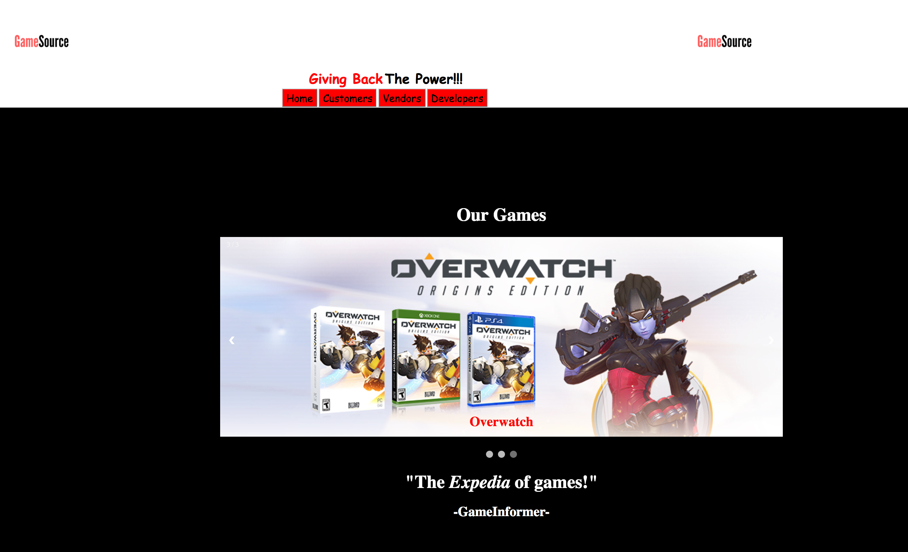

<h1>Game Developer Database</h1>

<h4> by: Chandan Thakur, Greg Engler, and Dennis Carrasquillo</h4>

<h1>Summary</h1>

A video game database website that allows customers, vendors, and developers to market their video games. The project utilizes the Spring MVC framework with CRUD functionality as well as MySQL with a database created by us. When using this application as  the customer you will be able to buy games and see the list of games from the different vendors. As a vendor, you will be able to see the list/inventory of the games as well as be able to change the price. As a developer you can edit, create, and delete a game from the inventory/list of games.

<h2> Future Goals</h2>

As for some stretch goals, we wanted to make it so the vendor could purchase a game or a number of games from the developer. We also wanted to add a search function where you can type the name of the game you want and our site will return the different vendors and prices for that game (like Expedia). The end goal of course would be to add as many vendors as we could so we could market this site as the Expedia of video games.

<h2>Trials and Tribulations</h2>

We experienced our fair share of trials for this project. One problem that seems to be present in most projects is getting the CSS to cooperate in the way you want it to. Ww are sure that will come with practice.

##### View with Edit and Delete buttons

