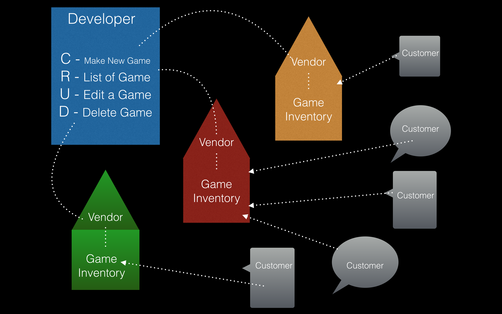
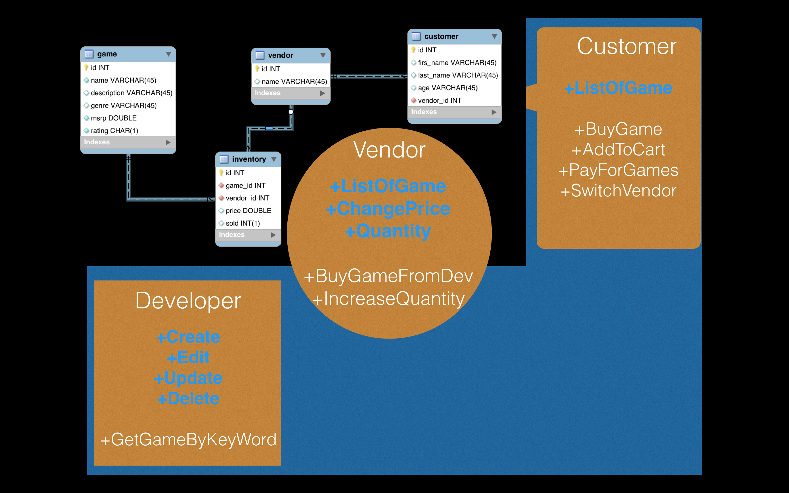

<h1>Game Developer Database</h1>

<h4> by: Chandan Thakur, Greg Engler, and Dennis Carrasquillo</h4>

<h1>Summary</h1>

A video game database website that allows customers, vendors, and developers to market their video games. The project utilizes the Spring MVC framework with CRUD functionality as well as MySQL with a database created by us. When using this application as the customer you will be able to view a list of games. As a vendor, you will be able to see the list/inventory of the games as well as be able to change the price. As a developer you can edit, create, and delete a game from the inventory/list of games.

<h2>Goals</h2>

<h2>Outline</h2>

<h2>Landing Page</h2>

<h2>Future Goals</h2>

As for some stretch goals, we wanted to add functionality so the vendor could purchase a game or a number of games from the developer.  We also would have liked to have enabled a purchase function in the customer list where when a customer purchased a game, it would reflect in the inventory in our database.  In addition, we wanted to add a search function to each list where you can search a game by keyword.

<h2>Trials and Tribulations</h2>

We experienced our fair share of issues for this project. One problem that seems to be present in most projects is getting the CSS to cooperate in the way you want it to. We also ran into issues getting our JSPs to function properly with our controller, implementation classes, and database.

##### View with Edit and Delete buttons
